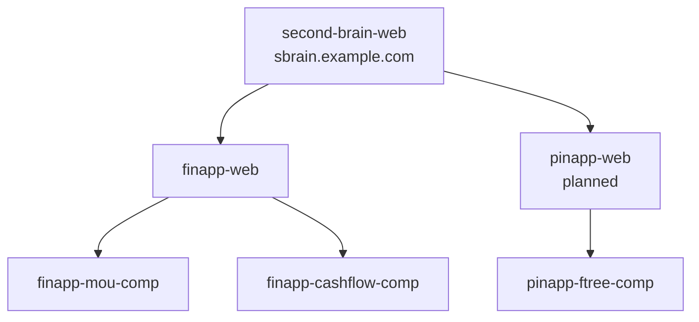
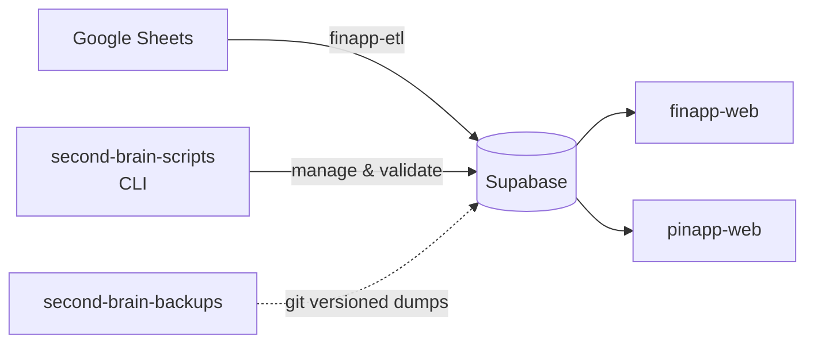

# Second Brain

One app for everything you. A self-hosted platform that replaces scattered spreadsheets, contacts, and notes with structured, queryable, visualized data about your own life.

Hosted at [sbrain.example.com](https://sbrain.example.com).

## What is this?

Second Brain is a collection of micro-frontend applications unified under a single shell. Each app owns a domain of your life:

| App | Purpose |
|-----|---------|
| **finapp** | Financial Information Application — income, spending, investments, pay scale |
| **pinapp** | Personal Information Application — people, relationships, family tree, contacts |
| **minapp** | Miscellaneous Information Application — Spotify stats, personal tracking _(planned)_ |

The philosophy: own your data, understand your life, escape the matrix.

## Ecosystem Overview

## Data Pipeline

## Repos

| Repo | What it is |
|------|------------|
| [second-brain-web](./second-brain/) | Shell app — composes all MFE apps _(in progress)_ |
| [finapp-web](./finapp-web/) | Finance app — MFE host for finapp components |
| [finapp-mou-comp](./finapp-mou-comp/) | MFE — County pay scale / MOU visualizer |
| [finapp-cashflow-comp](./finapp-cashflow-comp/) | MFE — Personal cashflow & housing |
| [pinapp-ftree-comp](./pinapp-ftree-comp/) | MFE — Family tree & contacts |
| [second-brain-scripts](./second-brain-scripts/) | CLI tooling for DB management & validation |
| [second-brain-backups](./second-brain-backups/) | Git-versioned database backups |

## Docs

- [finapp — Financial Information Application](./docs/finapp.md)
- [pinapp — Personal Information Application](./docs/pinapp.md)
- [second-brain-web — Shell Application](./docs/second-brain-web.md)
- [second-brain-scripts & finapp-etl — CLI Tooling](./docs/second-brain-scripts.md)
- [Future Apps](./docs/future.md)

## Tech Stack (shared across repos)

- **Frontend**: React 19, Vite, Tailwind CSS, TypeScript
- **MFE**: `vite-plugin-federation` (Module Federation)
- **Database**: Supabase (PostgreSQL)
- **ETL**: Deno (finapp-etl), Node.js (second-brain-scripts)
- **Visualization**: Recharts, @xyflow/react
