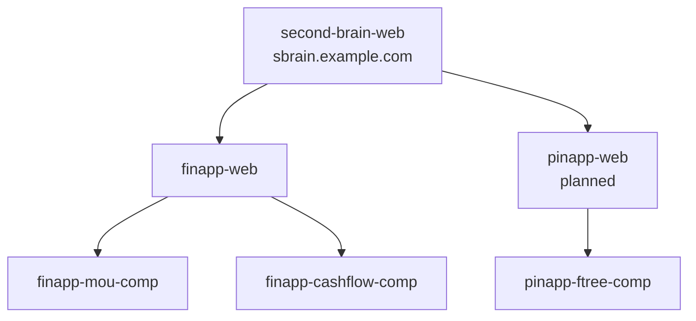
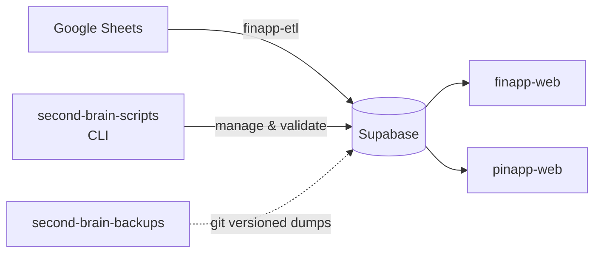

# Second Brain

One app for everything you. A self-hosted platform that replaces scattered spreadsheets, contacts, and notes with structured, queryable, visualized data.

Hosted at [sbrain.example.com](https://sbrain.example.com).

## Quick Navigation

- [Documentation Home](./docs/index.md)
- [Architecture Overview](./docs/architecture/overview.md)
- [Micro-Frontend Composition](./docs/architecture/mfe.md)
- [Data Pipeline](./docs/architecture/data-pipeline.md)
- [Schema Overview](./docs/schema/overview.md)

## Application Docs

- [second-brain-web](./docs/apps/second-brain-web.md)
- [finapp](./docs/apps/finapp.md)
- [pinapp](./docs/apps/pinapp.md)
- [future apps](./docs/apps/future.md)

## CLI and ETL

- [second-brain-scripts and finapp-etl](./docs/cli/second-brain-scripts.md)

## Repo Index

Second Brain is a collection of micro-frontend applications unified under a single shell:

| App | Purpose |
|-----|---------|
| **finapp** | Financial Information Application — income, spending, investments, pay scale |
| **pinapp** | Personal Information Application — people, relationships, family tree, contacts |
| **minapp** | Miscellaneous Information Application — Spotify stats, personal tracking _(planned)_ |

## Ecosystem Overview

## Data Pipeline

## Repos

| Repo | What it is |
|------|------------|
| [second-brain-web](./docs/apps/second-brain-web.md) | Shell app — composes all MFE apps _(in progress)_ |
| [finapp-web](./docs/apps/finapp.md) | Finance app — MFE host for finapp components |
| [finapp-mou-comp](./docs/comps/finapp-mou-comp.md) | MFE — County pay scale / MOU visualizer |
| [finapp-cashflow-comp](./docs/comps/finapp-cashflow-comp.md) | MFE — Personal cashflow & housing |
| [pinapp-ftree-comp](./docs/comps/pinapp-ftree-comp.md) | MFE — Family tree & contacts |
| [second-brain-scripts](./docs/cli/second-brain-scripts.md) | CLI tooling for DB management & validation |
| [second-brain-backups](./docs/cli/second-brain-scripts.md) | Git-versioned database backups |

## Tech Stack (shared across repos)

- **Frontend**: React 19, Vite, Tailwind CSS, TypeScript
- **MFE**: `vite-plugin-federation` (Module Federation)
- **Database**: Supabase (PostgreSQL)
- **ETL**: Deno (finapp-etl), Node.js (second-brain-scripts)
- **Visualization**: Recharts, @xyflow/react
