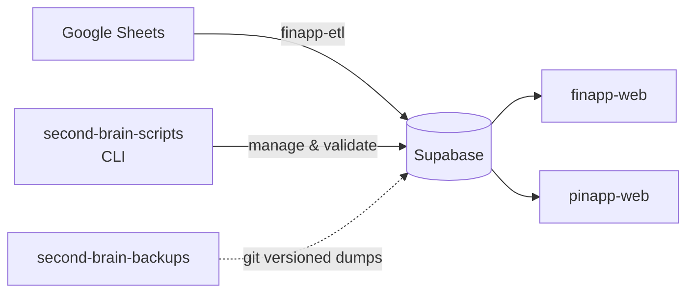

# Data Pipeline

Second Brain data enters through ETL/CLI tooling and is consumed by web apps.

## Data Producers

- `finapp-etl`: finance sync from Google Sheets into Supabase
- `second-brain-scripts`: schema inspection, validation, admin operations

## Data Consumers

- finapp remotes and host apps
- pinapp remotes and host apps

## Data Integrity

- Validation is centralized in `second-brain-scripts`
- Read-heavy use cases should prefer summary/views schemas where available

## Related Docs

- [CLI and ETL docs](../cli/second-brain-scripts.md)
- [Schema overview](../schema/overview.md)
