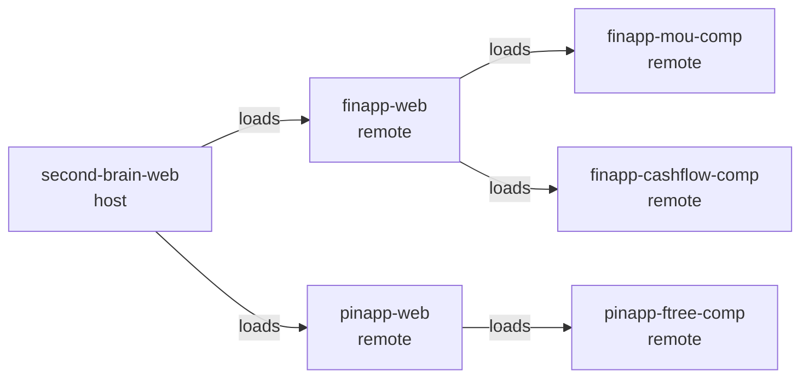

# Micro-Frontend Composition

Each application can run in one of two modes:

- Standalone development mode
- Remote mode loaded by a host via Module Federation

## Composition Graph

## Shell Responsibilities

- Top-level routing across app domains
- Shared auth lifecycle
- Shared shell layout (navigation/sidebar)
- Runtime wiring for remote entry points

## Why This Pattern

- Independent deployment and iteration by app
- Clear boundaries between domain ownership
- Shared UX shell without monolith coupling

## Related Docs

- [Architecture Overview](./overview.md)
- [second-brain-web app doc](../apps/second-brain-web.md)
