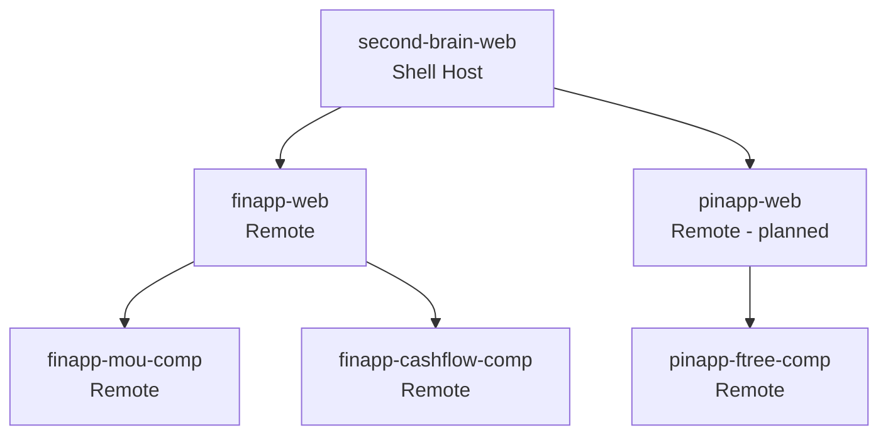

# Architecture Overview

Second Brain is a multi-repo, micro-frontend ecosystem with a shared data backend.

## Domains

| Domain | Primary app(s) | Data schemas |
|--------|-----------------|--------------|
| Finance | finapp-web, finapp-mou-comp, finapp-cashflow-comp | `finapp_data`, `finapp_summaries`, `finapp_views`, `finapp_journal`, `finapp_benchmarks` |
| People | pinapp-ftree-comp, pinapp-web (planned) | `people`, `property` |
| Shell | second-brain-web | Shared auth/routing/composition |

## Core Patterns

- Every app can run standalone for development.
- Host apps load remotes at runtime via Module Federation.
- Data is centralized in Supabase and segmented by schema.
- CLI tools and ETL pipelines own ingestion and validation.

## Related Docs

- [Micro-Frontend Composition](./mfe.md)
- [Data Pipeline](./data-pipeline.md)
- [Docs Home](../index.md)
