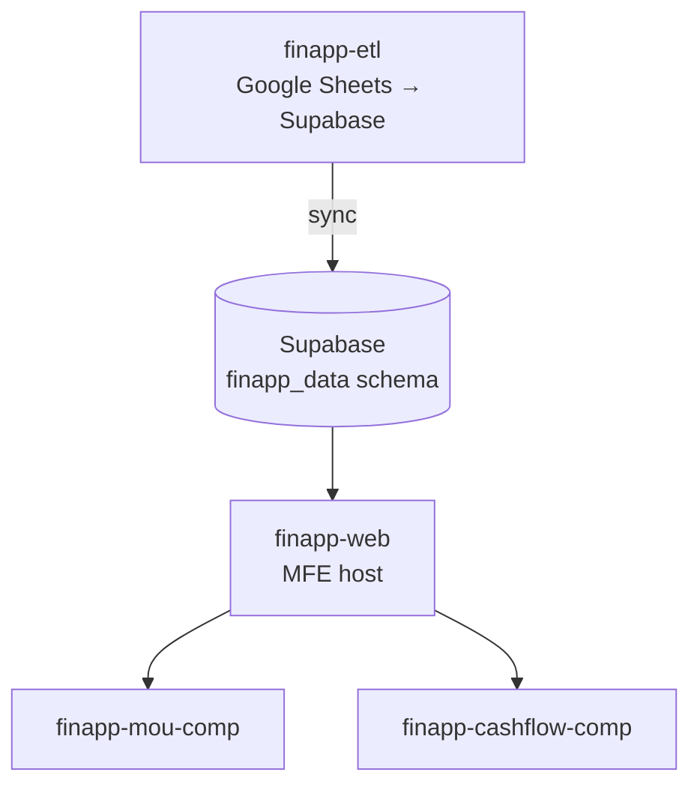
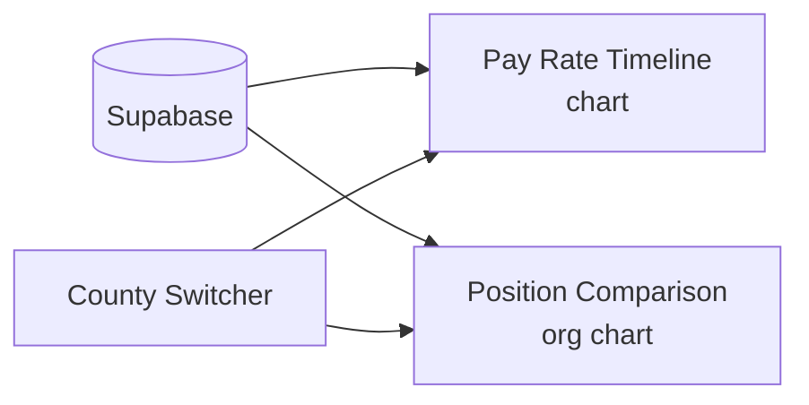
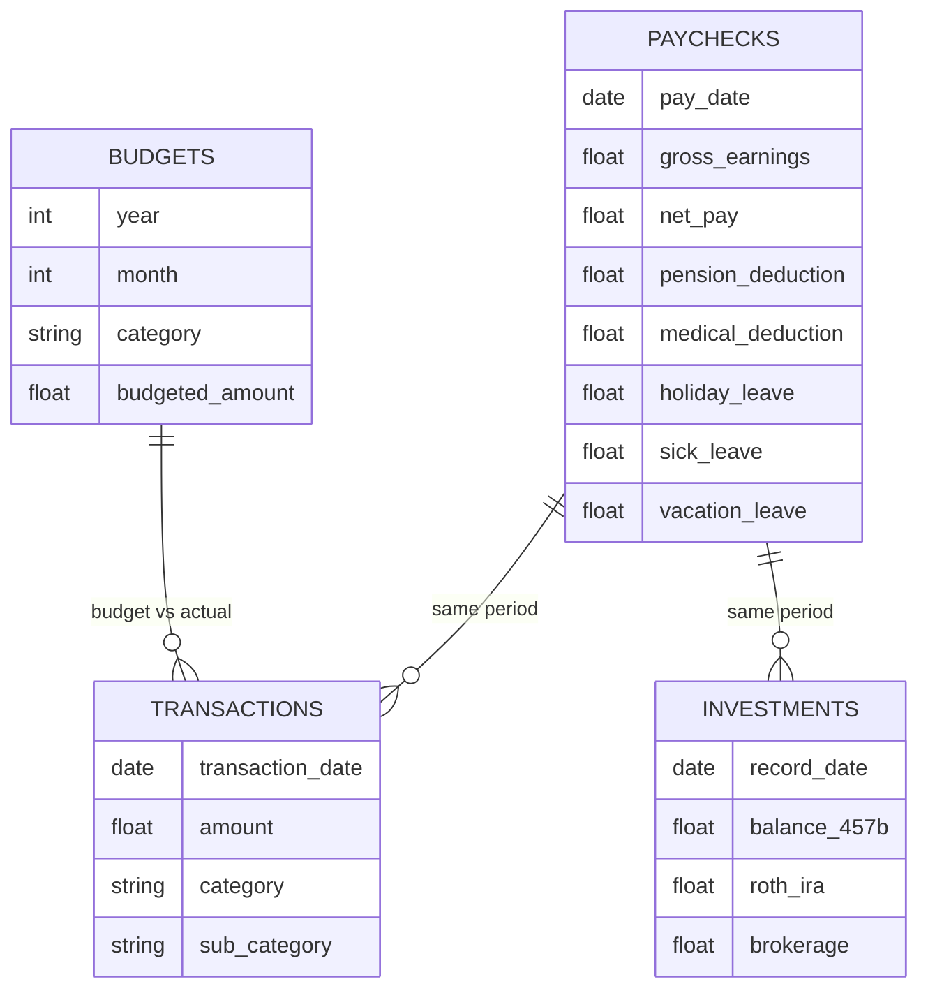

# finapp — Financial Information Application

finapp is your personal finance tracker — paychecks, spending, investments, budgets, housing, car, and side income. It also includes a tool for understanding your county employment contract (the MOU) — built to help you model your pay, compare positions, and think clearly about escaping the 9-5.

## Goals

- Replace finance spreadsheets with queryable, persistent data
- Visualize cashflow and understand where money goes month to month
- Track pay scale and position changes over time
- MOU tool: marketable to coworkers who want the same contract clarity

## How it fits together

---

## finapp-web

The React host app for finapp micro-frontends. Handles routing, auth, and shared layout. Composes `finapp-mou-comp` and `finapp-cashflow-comp` via Module Federation.

**Stack**: React 19, Vite, Supabase, Recharts, Tailwind CSS

> Currently being consolidated — features from the older `personal/finapp/finapp-web` (MUI + Nivo) are being migrated in over time.

---

## finapp-mou-comp

Visualizes pay rates and positions from the Memorandum of Understanding (MOU) between the Teamsters and the county.

**Who it's for**: County employees who want to understand their pay history, compare positions, and model career moves.

**Features**:
- County switcher (LA, Orange, Riverside, San Bernardino)
- Pay rate timeline chart — see how rates changed over time
- Position comparison / org chart — compare roles side by side
- Mobile responsive
- Static export mode for GitHub Pages hosting

**Stack**: React 19, Vite (Module Federation), Recharts, Supabase, Tailwind

---

## finapp-cashflow-comp

The "am I making progress?" view — personal spending vs. income over time.

**Features**:
- Cashflow: income vs. spending by month
- Housing expense breakdown
- Utilities tracking
- Living expense categories

**Stack**: React 19, Vite (Module Federation), Recharts, Supabase, Tailwind

---

## Data Model

### Core tables

### Transaction categories

`Life` · `Electronics` · `Bills` · `Groceries` · `Car` · `EatingOut` · `Entertainment` · `Gift`

### Other tracked data

| Table | What |
|-------|------|
| `car` | Car expenses and maintenance |
| `housing` | Mortgage, taxes, insurance, HOA |
| `contributions` | 457b, Roth IRA contribution amounts |
| `sidegigs` | Freelance / contract income |
| `tab_log` | Custom ad-hoc tracking |

---

## ETL Pipeline

Data flows from Google Sheets into Supabase via `finapp-etl`. See [second-brain-scripts & finapp-etl](./second-brain-scripts.md) for the full CLI reference.

The ETL lives at `personal/finapp/finapp-etl/` and will eventually be renamed to `second-brain-etl` as it expands beyond finance data.
