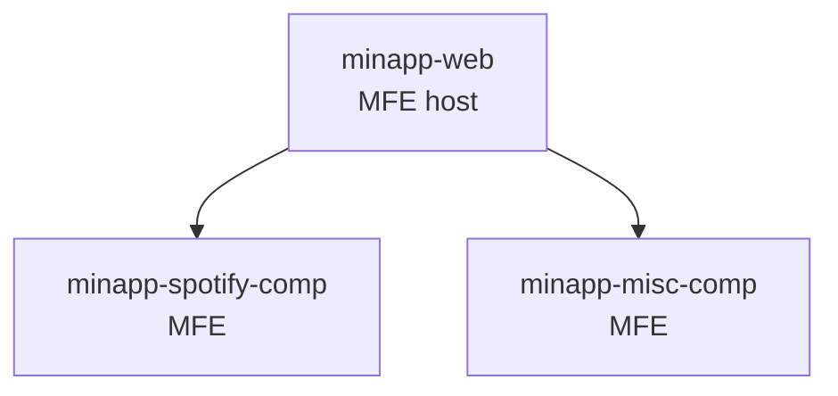

# Future Apps

## minapp — Miscellaneous Information Application

A third pillar alongside finapp and pinapp for self-tracking data that doesn't fit either category.

**Planned data**:
- Spotify listening stats
- Personal metrics and random stats
- Anything that doesn't belong in finance or people

**Status**: No repo yet. Data concepts exist in second-brain-scripts schemas. Will follow the same MFE pattern as finapp and pinapp.

---

## second-brain-etl

`finapp-etl` (`personal/finapp/finapp-etl/`) will eventually be renamed and expanded into `second-brain-etl` — a universal ETL tool for all second brain data domains, not just finance.

| Phase | Scope |
|-------|-------|
| Now | finapp data only (Google Sheets → Supabase) |
| Next | pinapp data management |
| Future | minapp / Spotify / misc data sources |

---

## Roadmap Summary

| App | Repo | Status |
|-----|------|--------|
| `second-brain-web` | `./second-brain/` | In progress (shell) |
| `pinapp-web` | TBD | Planned |
| `minapp-web` | TBD | Concept |
| `minapp-spotify-comp` | TBD | Concept |
| `second-brain-etl` | Rename of `finapp-etl` | Planned |
