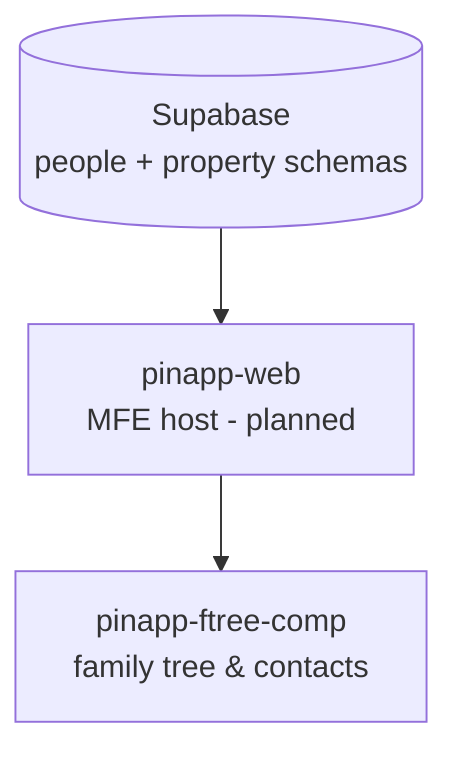
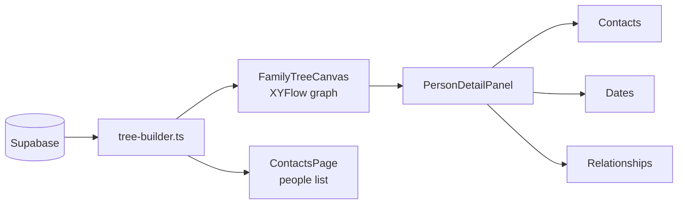
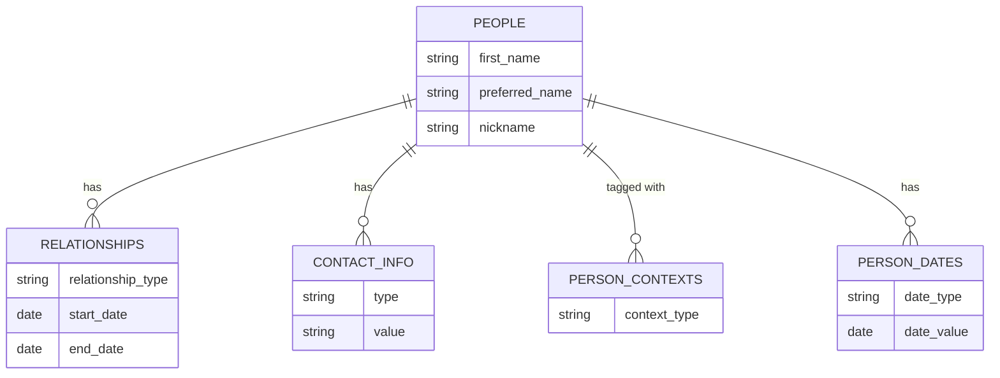
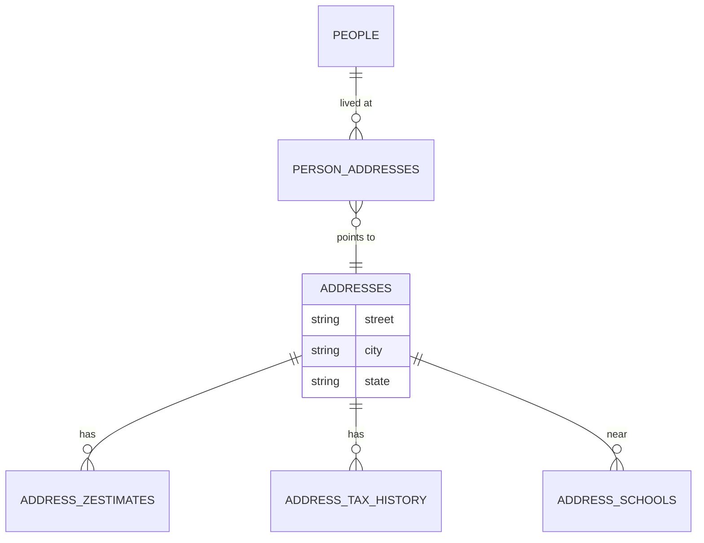

# pinapp — Personal Information Application

pinapp is a structured contact book and relationship tracker — people, family trees, contact info, life events, and context tags. It's the "who" to finapp's "what."

## Goals

- Replace scattered contacts and mental models with a queryable people database
- Visualize family trees and social networks
- Track relationships across different areas of life (work, family, friends, networking)
- Your data, your database — not locked in any platform

## How it fits together

---

## pinapp-web _(planned)_

The MFE host for pinapp components. Not yet built — `pinapp-ftree-comp` runs standalone today. Will mirror the pattern of `finapp-web` once built.

---

## pinapp-ftree-comp

Interactive family tree and contact viewer.

**Features**:
- Canvas-based family tree — drag, zoom, pan
- Person detail panel — contacts, key dates, relationships
- Context tagging — see who belongs to which part of your life
- Full-text search and filter
- Auth guard (login required)
- Static data fallback for offline / demo mode

**Stack**: React 19, Vite (Module Federation), @xyflow/react, Supabase, Tailwind, Vitest

---

## Data Model

### People & relationships

### Address history (property schema)

### Relationship types

`parent_of` · `sibling_of` · `friend_of` · `husband_of` · `wife_of` · `coworker_of` · `acquaintance_of` _(extensible)_

### Context types

| Context | What it means |
|---------|--------------|
| `family` | Blood relatives, in-laws |
| `work` | Coworkers, managers, reports |
| `friend` | Personal friends |
| `networking` | Professional contacts |
| `romantic` | Romantic history |
| `childhood` | People from early life |
| `other` | Everything else |

### Other tracked data

| Table | What |
|-------|------|
| `fun_facts` | Memorable things about a person |
| `cross_stitches` | Cross-stitch nametag tracking |
| `ethnicities` / `races` | Multiracial identity support |
| `person_date_types` | Birthday, death day, milestones |
| `contact_info_types` | Phone, email, LinkedIn, social |

---

## CLI Management

People data is managed via the `second-brain-scripts` CLI — add/update people, relationships, and contexts interactively. See [second-brain-scripts](./second-brain-scripts.md).
