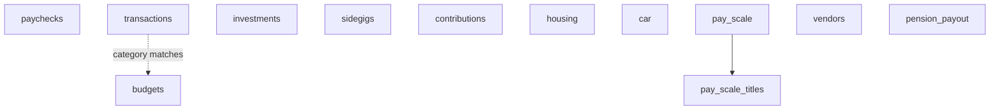

# finapp_data schema

Schema: `finapp_data` — core financial tracking tables. This is where all live finance data lives.

See also: [finapp_summaries / views](./finapp-summaries.md) · [finapp_benchmarks](./finapp-benchmarks.md)

---

## Table Map

---

## transactions

Daily expense tracking.

| Column | Type | Notes |
|--------|------|-------|
| `id` | text | Leave blank on import |
| `date` | date | |
| `year` | smallint | |
| `month` | text | 3-letter lowercase: `jan`, `feb`, ... |
| `day` | smallint | |
| `weekday` | text | |
| `week` | smallint | |
| `amount` | numeric | Positive = expense |
| `category` | text | PascalCase — see categories below |
| `sub_category` | text | PascalCase — column is `sub_category`, NOT `subcategory` |
| `business` | text | |
| `city` | text | Often blank |
| `state` | text | Often blank |
| `description` | text | Human-readable label |
| `comments` | text | Extra context |
| `recipient` | text | Who the purchase was for |
| `necessity` | text | `"need"` or `"want"` |
| `reimburse` | text | |
| `recurring` | text | |
| `ex` | boolean | Tagged as ex-related |
| `number` | numeric | Row sequence |

**8 categories (PascalCase):**
`Life` · `Electronics` · `Bills` · `Groceries` · `Car` · `EatingOut` · `Entertainment` · `Gift`

---

## paychecks

One row per paycheck.

| Column | Type | Notes |
|--------|------|-------|
| `id` | text | |
| `check_date` | date | Column is `check_date`, NOT `pay_date` |
| `start_date` / `end_date` | date | Pay period |
| `year` | smallint | |
| `month` | text | |
| `source` | text | e.g. "SB County ITD", "CSUF" |
| `hours_paid` | numeric | |
| `pay_rate` | numeric | |
| `overtime_hours` | numeric | |
| `gross_earnings` | numeric | NOT `gross` |
| `taxable_gross` | numeric | |
| `total_taxes` | numeric | |
| `total_deductions` | numeric | |
| `net_pay` | numeric | NOT `net` |
| `state_tax` / `medicare_tax` / `fed_tax` | numeric | |
| `deferred_comp` / `dental_insurance` / `medical_insurance` / `pension_cont` | numeric | |
| `holiday_earned/taken/adjust/current` | numeric | Leave accrual |
| `sick_earned/taken/adjust/current` | numeric | Leave accrual |
| `vacation_earned/taken/adjust/current` | numeric | Leave accrual |
| `pal_earned/taken/adjust/current` | numeric | Leave accrual |

> Always use `check_date` (not `pay_date`), `gross_earnings` (not `gross`), `net_pay` (not `net`).

---

## investments

Monthly portfolio snapshot — one row per account per month.

| Column | Type | Notes |
|--------|------|-------|
| `id` | text | |
| `start_date` / `end_date` | date | Month period |
| `year` | smallint | |
| `month` | text | |
| `type` | text | `"457b"`, `"Roth IRA"`, `"Brokerage"` |
| `beginning_balance` | numeric | |
| `ending_balance` | numeric | |
| `change_in_value` | numeric | |
| `change_in_percentage` | numeric | |

---

## sidegigs

Freelance and contract income.

| Column | Type | Notes |
|--------|------|-------|
| `id` | text | |
| `start_date` / `end_date` | date | NOT a single `date` column |
| `year` / `month` | various | |
| `hours_worked` | numeric | |
| `amount_paid` | numeric | |
| `company` | text | |
| `comments` | text | NOT `description` |

---

## budgets

Monthly category targets.

| Column | Type | Notes |
|--------|------|-------|
| `id` | text | |
| `category` | text | Matches transaction category |
| `amount` | numeric | Monthly budget target |
| `comments` | text | |

---

## housing

One row per month — separate columns for each cost type.

| Column | Type | Notes |
|--------|------|-------|
| `id` | text | |
| `start_date` / `end_date` | date | |
| `year` / `month` | various | |
| `rent_amount` / `rent_date` | numeric / date | |
| `insurance_amount` / `insurance_date` | numeric / date | |
| `pet_rent` / `fees` | numeric | |
| `electricity` / `water` / `gas` / `wifi` / `city_services` | numeric | Individual utilities |
| `total_utilities` / `total_housing` | numeric | Computed totals |

> No generic `type`/`amount` pattern — each cost has its own column.

---

## car

Amortization + insurance + mileage ledger per month.

| Column | Type | Notes |
|--------|------|-------|
| `id` | char | |
| `start_date` / `end_date` | date | |
| `year` / `month` | various | |
| `payment_date` / `payment_amount` | date / numeric | |
| `principal` / `interest` / `owed` | numeric | Loan detail |
| `insurance_amount` / `insurance_date` | numeric / date | |
| `start_miles` / `miles_added` / `miles_date` | int / int / date | Mileage |
| `total` | numeric | |

---

## contributions

Investment contributions (separate from balance snapshots in `investments`).

| Column | Type | Notes |
|--------|------|-------|
| `id` | text | |
| `date` | date | |
| `year` / `month` / `day` / `weekday` / `week` | various | |
| `amount` | numeric | |
| `account` | text | `"457b"`, `"Roth IRA"` — column is `account`, NOT `type` |
| `exclude` | boolean | |

---

## tab_logs

Metadata/audit table — tracks when each spreadsheet tab was last synced.

| Column | Type |
|--------|------|
| `tab_name` | text |
| `updated_at` | timestamp |

---

## vendors

Brand/company reference data.

| Column | Type | Notes |
|--------|------|-------|
| `id` | uuid | |
| `name` | text | |
| `logo_url` / `website` | text | |
| `category` | text | |
| `color` | text | Brand hex color |
| `parent_id` | uuid | Self-ref for corporate hierarchy |

---

## pay_scale

SBC county pay grade/step reference (~730 rows).

| Column | Type | Notes |
|--------|------|-------|
| `id` | integer | |
| `code` | text | Pay grade code (e.g. `"63C"`, `"67"`) |
| `effective_date` | date | When this rate became effective |
| `step` | integer | Step number within grade (1–10+) |
| `hourly` | numeric | |
| `biweekly` | numeric | |
| `monthly` | numeric | |
| `annually` | numeric | |

Join with `pay_scale_titles` on `code` to get job title for a given rate.

## pay_scale_titles

Maps pay grade codes to job titles (~14 rows).

| Column | Type | Notes |
|--------|------|-------|
| `id` | integer | |
| `code` | text | Matches `pay_scale.code` |
| `abbreviation` | text | e.g. `"PA II"`, `"BSA III"` |
| `title` | text | e.g. `"Programmer Analyst II"` |

**Common titles**: PA I/II/III (Programmer Analyst) · BSA I/II/III (Business Systems Analyst) · EPA (Enterprise Programmer Analyst) · P I/II/III (Programmer)

---

## pension_payout

Matrix of `years_of_service` × `retirement_age`. `is_my_path` flags the user's projected retirement path (~704 rows).

---

## Column Name Gotchas

| Wrong | Right | Table |
|-------|-------|-------|
| `pay_date` | `check_date` | paychecks |
| `gross` | `gross_earnings` | paychecks |
| `net` | `net_pay` | paychecks |
| `subcategory` | `sub_category` | transactions |
| `description` | `comments` | sidegigs |
| `type` | `account` | contributions |
| `amount` | `monthly_amount` | address_hoa_history |
