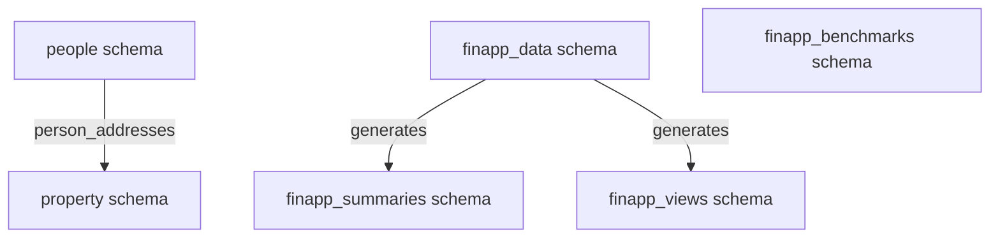
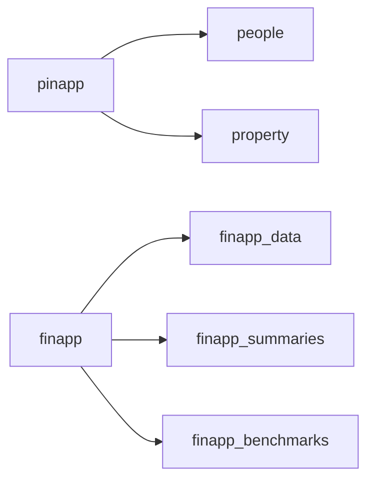

# Database Schema Overview

**Supabase Project**: redacted-project (`REDACTED_PROJECT_REF`)

All second brain data lives in a single Supabase project split across multiple schemas by domain.

## Schemas at a Glance

| Schema | Owner | Purpose |
|--------|-------|---------|
| [`people`](./pinapp-people.md) | pinapp | People, relationships, contact info, dates, contexts |
| [`property`](./pinapp-property.md) | pinapp | Addresses, geography, property history, price events |
| [`finapp_data`](./finapp-core.md) | finapp | Core financial data — transactions, paychecks, investments |
| [`finapp_summaries`](./finapp-summaries.md) | finapp | Pre-aggregated read-only summary tables |
| [`finapp_views`](./finapp-summaries.md#finapp_views) | finapp | Derived views (leave balances, category lists) |
| [`finapp_journal`](./finapp-summaries.md#finapp_journal) | finapp | Financial journal entries |
| [`finapp_benchmarks`](./finapp-benchmarks.md) | finapp | External reference data (BLS, IRS, Fed, Zillow) |

## Schema Relationships

## Domain Map

## Table Count by Schema

| Schema | Tables |
|--------|--------|
| `people` | 18 |
| `property` | 15 |
| `finapp_data` | 13 core + 1 pay scale set |
| `finapp_summaries` | 50+ pre-aggregated transum/paysum tables |
| `finapp_benchmarks` | 12 reference tables |

## Detailed Docs

- [people schema — People & Relationships](./pinapp-people.md)
- [property schema — Addresses & Geography](./pinapp-property.md)
- [finapp_data schema — Core Finance Tables](./finapp-core.md)
- [finapp_summaries / views / journal](./finapp-summaries.md)
- [finapp_benchmarks — Reference Data](./finapp-benchmarks.md)
