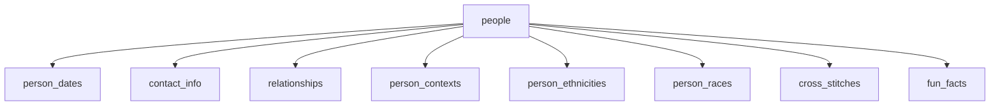

# people schema

Schema: `people` — core pinapp data. People, relationships, contact info, dates, contexts, ethnicities, and cross-stitches.

See also: [property schema](./pinapp-property.md) for addresses.

---

## Table Map



---

## people

Primary person record.

| Column | Type | Notes |
|--------|------|-------|
| `id` | integer | PK |
| `first_name` | text | Legal/given name — always populated |
| `middle_name` | text | |
| `last_name` | text | |
| `preferred_name` | text | What they go by day-to-day — NULL if same as `first_name` |
| `nickname` | text | Informal name or title (e.g. "Uncle Buds") — NULL if same as preferred/first |
| `birth_last_name` | text | Maiden name |
| `suffix` | text | Jr., Sr., III, etc. |
| `gender` | text | |
| `is_deceased` | boolean | |

### Name field rules

| Field | Populate when |
|-------|--------------|
| `first_name` | Always |
| `preferred_name` | Only when different from `first_name` |
| `nickname` | Only when distinct from both first and preferred — titles ("Aunt Pat", "Uncle Buds") go here |

Never set `preferred_name` equal to `first_name`. Never set `nickname` equal to `preferred_name`.

---

## person_dates

Birthdays, death days, and other life milestones. Dates do **not** live on the `people` table.

| Column | Type | Notes |
|--------|------|-------|
| `id` | integer | PK |
| `person_id` | integer | FK → people.id |
| `date_type_id` | integer | FK → person_date_types.id |
| `date` | date | |
| `is_recurring` | boolean | e.g. annual birthday |
| `notes` | text | |

### person_date_types (lookup)

| id | value |
|----|-------|
| 1 | birthday |
| 2 | deathday |
| 5 | got_job |
| 8 | lutheran_confirmation |
| 9 | lutheran_baptism |

---

## contact_info

| Column | Type | Notes |
|--------|------|-------|
| `id` | integer | PK |
| `person_id` | integer | FK → people.id |
| `contact_info_type_id` | integer | FK → contact_info_types.id |
| `value` | text | The actual phone/email/handle |
| `notes` | text | |

### contact_info_types (lookup)

| id | value |
|----|-------|
| 3 | insta |
| 4 | linkedin |
| 8 | handle |
| 9 | personal-phone |
| 10 | home-phone |
| 11 | personal-email |
| 12 | work-email |
| 13 | finsta |

---

## relationships

Person-to-person links. Directional — read as "person_a IS [type] TO person_b".

| Column | Type | Notes |
|--------|------|-------|
| `id` | integer | PK |
| `person_a_id` | integer | FK → people.id |
| `person_b_id` | integer | FK → people.id |
| `relationship_type_id` | integer | FK → relationship_types.id |
| `since_date` | date | When relationship started |
| `until_date` | date | When relationship ended |
| `is_ended` | boolean | |
| `end_reason_id` | integer | FK → relationship_end_reasons.id |
| `notes` | text | |

### relationship_types (lookup)

**Family:**
`father_of` · `mother_of` · `son_of` · `daughter_of` · `brother_of` · `sister_of` · `grandfather_of` · `grandmother_of` · `grandchild_of` · `aunt_of` · `uncle_of` · `niece_of` · `nephew_of`

**Extended Family:**
`cousin_of` · `cousin_once_removed_of` · `second_cousin_of` · `brother_in_law_of` · `sister_in_law_of` · `step_father_of` · `step_mother_of` · `step_child_of` · `half_brother_of` · `half_sister_of` · `adopted_son_of` · `adopted_daughter_of` · `adoptive_parent_of`

**Romantic:**
`husband_of` · `wife_of` · `boyfriend_of` · `girlfriend_of` · `ex_husband_of` · `ex_wife_of` · `ex_boyfriend_of` · `ex_girlfriend_of`

**Other:**
`friend_of` · `coworker_of`

> Relationships are reciprocal — if A→B exists, B→A should too. The validator checks for missing pairs.

---

## Context tables

### context_types (lookup)

| id | value |
|----|-------|
| 1 | family |
| 2 | work |
| 3 | friend |
| 4 | networking |
| 5 | romantic |
| 6 | childhood |
| 7 | other |
| 8 | me |

### context_details

Sub-categories within a context type.

| Column | Type | Notes |
|--------|------|-------|
| `id` | integer | PK |
| `context_type_id` | integer | FK → context_types.id |
| `value` | text | Specific context label |

### person_contexts

| Column | Type | Notes |
|--------|------|-------|
| `person_id` | integer | FK → people.id |
| `context_type_id` | integer | FK → context_types.id |
| `context_detail_id` | integer | FK → context_details.id |
| `since_date` | date | |
| `is_active` | boolean | |
| `notes` | text | |

---

## Ethnicity & Race tables

### ethnicities

Heritage/ethnic backgrounds. No seed data — inserted on demand.

| Column | Type |
|--------|------|
| `id` | integer |
| `value` | text (e.g. "German", "Irish", "Mexican") |

### person_ethnicities

Junction — one row per ethnicity per person.

| Column | Type |
|--------|------|
| `person_id` | integer |
| `ethnicity_id` | integer |

### races (lookup)

| value |
|-------|
| White / Caucasian |
| Black / African American |
| Hispanic / Latino |
| Asian |
| Native American / Alaska Native |
| Native Hawaiian / Pacific Islander |
| Middle Eastern / North African |

### person_races

Junction — supports multiracial (one row per race per person).

| Column | Type |
|--------|------|
| `person_id` | integer |
| `race_id` | integer |

---

## cross_stitches

Tracks cross-stitch nametags made for people.

| Column | Type | Notes |
|--------|------|-------|
| `id` | integer | PK |
| `person_id` | integer | FK → people.id |
| `cross_stitch_type` | text | Column name is `cross_stitch_type`, NOT `nametag_type` |
| `made_date` | date | |
| `delivered_date` | date | |
| `design_notes` | text | |
| `photo_url` | text | |

---

## fun_facts

| Column | Type |
|--------|------|
| `id` | integer |
| `person_id` | integer |
| `fact` | text |

---

## Common Queries

### Find person by name
Always search all name fields:
```sql
SELECT id, first_name, preferred_name, last_name, nickname
FROM people.people
WHERE LOWER(first_name) LIKE LOWER('%Lee%')
   OR LOWER(preferred_name) LIKE LOWER('%Lee%')
   OR LOWER(last_name) LIKE LOWER('%Nelson%')
   OR LOWER(nickname) LIKE LOWER('%Lee%');
```

### Get person's relationships
```sql
SELECT rt.value AS relationship_type,
       pb.first_name || ' ' || pb.last_name AS with_person,
       r.since_date, r.is_ended
FROM people.relationships r
JOIN people.people pb ON r.person_b_id = pb.id
JOIN people.relationship_types rt ON r.relationship_type_id = rt.id
WHERE r.person_a_id = 149;
```

### Get birthday / death date
```sql
-- Birthday (type 1)
SELECT date FROM people.person_dates WHERE person_id = 149 AND date_type_id = 1;

-- Deathday (type 2)
SELECT date FROM people.person_dates WHERE person_id = 149 AND date_type_id = 2;
```

---

## Tables that do NOT exist

| Wrong table | Use instead |
|-------------|------------|
| `people.date_types` | `people.person_date_types` |
| `people.interactions` | does not exist |
| `people.preferences` | `people.fun_facts` |
| `people.nametags` | `people.cross_stitches` |
