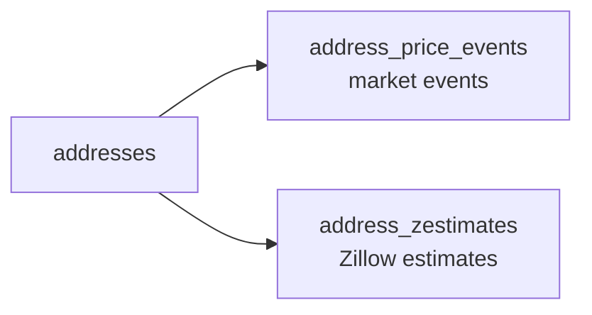

# property schema

Schema: `property` — all address and real estate data for pinapp. Always use `property.table_name` syntax — these are **not** in the `people` schema.

See also: [people schema](./pinapp-people.md).

---

## Geographic Hierarchy

Addresses use normalized geography — never store city/state as plain strings.


Always join through the full chain to get readable city/state values.

---

## Core Address Tables

### addresses

Static property record. **No price fields** — prices live in `address_price_events` and `address_zestimates`.

| Column | Type | Notes |
|--------|------|-------|
| `id` | integer | PK |
| `street` | text | |
| `city_id` | integer | FK → cities.id — NOT a plain text city column |
| `zip` | text | |

### cities

| Column | Type |
|--------|------|
| `id` | integer |
| `county_id` | integer |
| `name` | text |

### counties

| Column | Type |
|--------|------|
| `id` | integer |
| `state_id` | integer |
| `name` | text |

### states

| Column | Type | Notes |
|--------|------|-------|
| `id` | integer | |
| `code` | text | e.g. "CA" |
| `name` | text | e.g. "California" |
| `country_id` | integer | FK → countries.id |

### countries

| Column | Type | Notes |
|--------|------|-------|
| `id` | integer | |
| `code` | text | e.g. "US" |
| `name` | text | e.g. "United States" |

---

## address_details

Property characteristics — one row per address.

| Column | Type |
|--------|------|
| `address_id` | integer |
| `bedrooms` | integer |
| `bathrooms` | numeric |
| `sqft` | integer |
| `lot_sqft` | integer |
| `year_built` | integer |
| `parcel_number` | text |
| `zillow_url` | text |
| `walk_score` | integer |
| `transit_score` | integer |
| `bike_score` | integer |

---

## Person ↔ Address Link

### person_addresses

Links a person to an address with context about their tenure.

| Column | Type | Notes |
|--------|------|-------|
| `person_id` | integer | FK → people.people.id |
| `address_id` | integer | FK → addresses.id |
| `is_current` | boolean | |
| `since_date` | date | |
| `until_date` | date | |
| `address_relationship_type_id` | integer | FK → address_relationship_types.id |
| `tenure_type_id` | integer | FK → tenure_types.id |
| `notes` | text | |

### address_relationship_types (lookup)

| id | value |
|----|-------|
| 1 | primary_residence |
| 2 | previous_residence |
| 3 | childhood_home |
| 4 | vacation_home |
| 5 | rental_property |

### tenure_types (lookup)

| id | value |
|----|-------|
| 1 | owner |
| 2 | renter |
| 3 | resident |

---

## Price & Value Tracking

Prices are event-based — never stored as columns on `addresses`.



### address_price_events

| Column | Type | Notes |
|--------|------|-------|
| `id` | integer | |
| `address_id` | integer | |
| `event_date` | date | |
| `event_type` | text | See types below |
| `price` | numeric | |
| `price_per_sqft` | numeric | |
| `source` | text | e.g. "CRMLS", "Public Record", "Zillow" |
| `notes` | text | |

**Event types**: `sold` · `listed` · `listed_for_rent` · `pending` · `price_change` · `delisted`

### address_zestimates

Zillow automated estimates tracked over time.

| Column | Type |
|--------|------|
| `id` | integer |
| `address_id` | integer |
| `estimate_date` | date |
| `value` | numeric |

> Use LATERAL joins to get the latest price/zestimate efficiently:
> ```sql
> LEFT JOIN LATERAL (
>   SELECT price, event_date FROM property.address_price_events
>   WHERE address_id = a.id ORDER BY event_date DESC LIMIT 1
> ) latest_price ON true
> ```

---

## Other Property Tables

### address_tax_history

| Column | Type |
|--------|------|
| `address_id` | integer |
| `year` | integer |
| `property_tax` | numeric |
| `tax_assessment` | numeric |

### address_hoa_history

| Column | Type | Notes |
|--------|------|-------|
| `id` | integer | |
| `address_id` | integer | |
| `year` | integer | Use `year`, NOT date ranges |
| `monthly_amount` | numeric | Column is `monthly_amount`, NOT `amount` |
| `notes` | text | |

### address_schools

Links address to nearby schools.

| Column | Type |
|--------|------|
| `address_id` | integer |
| `school_id` | integer |
| `distance_mi` | numeric |

### schools

| Column | Type |
|--------|------|
| `id` | integer |
| `name` | text (UNIQUE) |
| `level` | text |
| `grade_range` | text |
| `rating` | numeric |
| `rating_max` | numeric |
| `source` | text |

### address_events

General address event log (non-price events).

### market_events

Macro market events (not tied to a specific address).

---

## Common Queries

### Get address with readable city/state
```sql
SELECT a.street, c.name AS city, co.name AS county, s.name AS state, s.code, a.zip
FROM property.addresses a
LEFT JOIN property.cities c ON a.city_id = c.id
LEFT JOIN property.counties co ON c.county_id = co.id
LEFT JOIN property.states s ON co.state_id = s.id
WHERE a.street ILIKE '%Yale%';
```

### Get person's address history
```sql
SELECT a.street, c.name AS city, s.code AS state,
       pa.is_current, pa.since_date, pa.until_date,
       art.value AS relationship_type, tt.value AS tenure
FROM property.person_addresses pa
JOIN property.addresses a ON pa.address_id = a.id
LEFT JOIN property.cities c ON a.city_id = c.id
LEFT JOIN property.counties co ON c.county_id = co.id
LEFT JOIN property.states s ON co.state_id = s.id
LEFT JOIN property.address_relationship_types art ON pa.address_relationship_type_id = art.id
LEFT JOIN property.tenure_types tt ON pa.tenure_type_id = tt.id
WHERE pa.person_id = 149
ORDER BY pa.is_current DESC, pa.since_date DESC;
```

### Common mistake

```sql
-- WRONG — these columns don't exist on addresses
SELECT a.price, a.last_sale_price, a.zestimate FROM property.addresses a;

-- RIGHT — join address_price_events / address_zestimates
```
