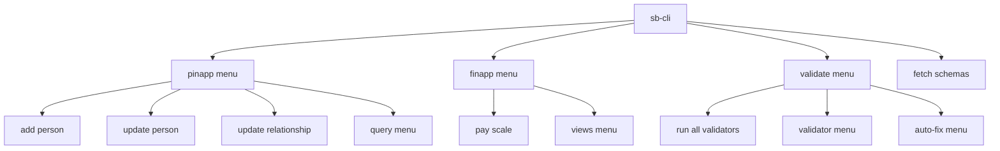
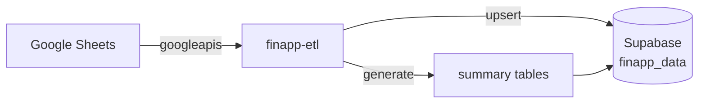
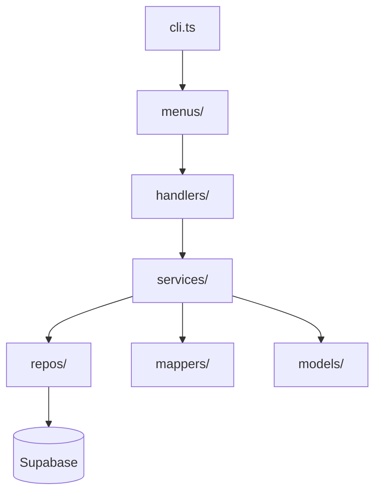

# second-brain-scripts & finapp-etl

The CLI backbone of second brain. Two tools, two concerns:

| Tool | Location | Runtime | Purpose |
|------|----------|---------|---------|
| `second-brain-scripts` | `second-brain-scripts/` | Node.js | DB management, validation, schema inspection |
| `finapp-etl` | `personal/finapp/finapp-etl/` | Deno | Google Sheets → Supabase sync (primary ETL) |

> `finapp-etl` will eventually be renamed `second-brain-etl` as it expands to handle pinapp and minapp data too.

---

## second-brain-scripts

Interactive CLI for managing your Supabase database — adding people, running validations, fetching schemas, and analyzing pay scales.

### Setup

Credentials go in `~/source/.config/supabase-creds.json`:

```json
{
  "url": "...",
  "serviceRoleKey": "...",
  "dbUrl": "..."
}
```

### Menu structure



### Commands

```bash
npm run menu          # People management (pinapp)
npm run validate      # Run full validation suite
npm run validate:menu # Pick validators interactively
npm run pay-scale     # Pay scale analysis
npm run views         # Finance views menu
npm run fetch         # Schema fetcher
npm run backup        # Database backup
npm run sql:exec      # Run a SQL file against the DB
```

### Validation suite

10+ validators that check data integrity:

| Validator | What it catches |
|-----------|----------------|
| `orphan-checks` | FK references pointing to deleted records |
| `duplicate-checks` | Duplicate person or address records |
| `relationship-checks` | Missing reciprocal pairs (if A→B exists, B→A should too) |
| `date-checks` | Invalid or malformed date fields |
| `data-quality-checks` | Required fields that are null or empty |
| `address-checks` | Incomplete address data |
| `context-checks` | People with inconsistent or missing context tags |
| `rls-checks` | Missing Row-Level Security policy coverage |

The auto-fix menu resolves many issues automatically: duplicate contexts, reciprocal relationships, redundant name entries, RLS policy gaps.

---

## finapp-etl

Deno CLI that pulls data from Google Sheets and syncs it into Supabase. This is how all finapp data gets into the database.

### Data flow



### Running it

```bash
deno run --allow-net --allow-read --allow-env --allow-write --allow-sys cli.ts
```

Requires a `.env` file with Google Sheets API credentials and Supabase connection string.

### Menu structure

```
1. Data Operations
   ├── Sync        — pull from Google Sheets into Supabase
   └── Summarize   — regenerate monthly summary tables

2. Data Analytics
   ├── Status      — row counts, last sync timestamps
   ├── Inspect     — browse table contents
   └── Export      — dump to CSV or JSON

3. Administration
   ├── Database    — create / drop tables
   ├── Views       — manage DB views
   └── Tables      — table-level operations

4. Danger Zone
   └── Delete operations (irreversible)
```

### Domains synced

| Domain | What's tracked |
|--------|---------------|
| Paychecks | Gross, net, taxes, deductions, leave accrual (holiday/sick/vacation/PAL) |
| Transactions | Date, amount, category, sub-category |
| Investments | 457b, Roth IRA, brokerage balances |
| Budgets | Monthly budget by category |
| Car | Car expenses and maintenance |
| Housing | Mortgage, taxes, insurance, HOA |
| Contributions | 457b and Roth contribution amounts |
| Side Gigs | Freelance and contract income |

### Architecture



Each data domain has its own service, repo, and model file — clean separation so adding a new data source means adding one set of files without touching the rest.

---

## Backups

`second-brain-backups/` is a git repo holding SQL dump exports — a simple version-controlled audit trail.

```bash
# Generate a backup
npm run backup          # from second-brain-scripts/

# Sync to git
./src/scripts/utils/sync-backups-to-git.ps1
```
