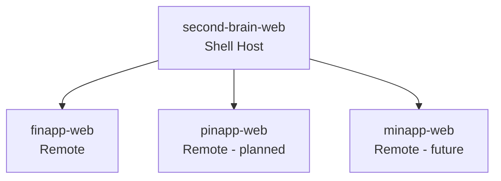
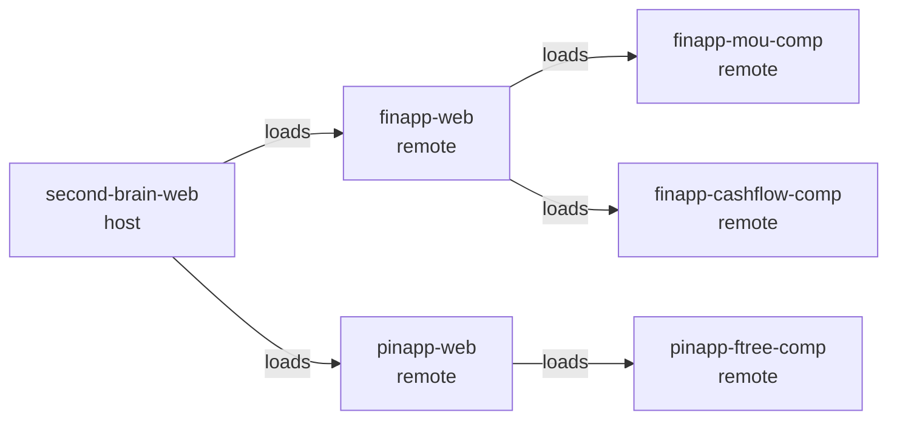

# second-brain-web

The top-level shell application. Hosted at [sbrain.example.com](https://sbrain.example.com). Composes all second brain apps into a single unified interface via Vite Module Federation.

## What it does

| Responsibility | Detail |
|---------------|--------|
| **Routing** | Top-level navigation between finapp, pinapp, and future apps |
| **Auth** | Shared Supabase Auth layer — one login for everything |
| **Shell UI** | Shared nav, sidebar, global styles |
| **MFE composition** | Loads each sub-app as a Module Federation remote |

## Architecture

## MFE Composition Pattern

Each app in the ecosystem can run standalone (for development) or as a remote loaded by a host. Remotes expose a root component via `vite-plugin-federation`.

Every component can be developed and deployed independently. The shell just wires them together at runtime.

## Planned URL Structure

| Route | App |
|-------|-----|
| `sbrain.example.com/` | Dashboard / home |
| `sbrain.example.com/finance` | finapp-web |
| `sbrain.example.com/people` | pinapp-web |
| `sbrain.example.com/misc` | minapp-web _(future)_ |

## Status

`second-brain-web` repo (`./second-brain/`) is the planned shell. Currently `finapp-web` acts as the effective entry point while the unified shell is being built. The MFE pattern is already proven across `finapp-mou-comp`, `finapp-cashflow-comp`, and `pinapp-ftree-comp`.

## Stack

- React 19, Vite, TypeScript
- `vite-plugin-federation` for Module Federation
- Supabase Auth (shared across all remotes)
- Tailwind CSS
