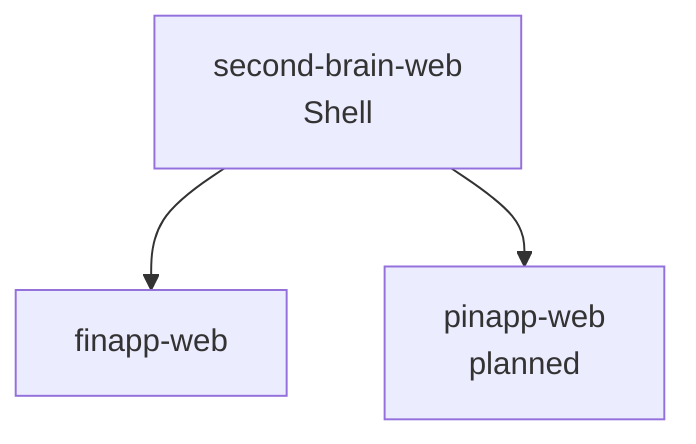

# second-brain-web

The top-level shell application for [sbrain.example.com](https://sbrain.example.com). Composes all second brain micro-frontend apps into a single unified interface.

Part of the [Second Brain](../README.md) ecosystem. See [docs home](../docs/index.md) and [shell app doc](../docs/apps/second-brain-web.md).

## What it does

- Single entry point for all second brain apps (finapp, pinapp, future minapp)
- Shared auth via Supabase — one login across everything
- Loads each sub-app as a Module Federation remote at runtime
- Top-level routing and shell UI (nav, sidebar)

## How apps are composed



## Stack

- React 19, Vite, TypeScript
- `vite-plugin-federation` (Module Federation)
- Supabase Auth
- Tailwind CSS

## Development

```bash
npm install
npm run dev
```

## Status

Shell is in progress. `finapp-web` currently acts as the effective entry point while this is being built.
